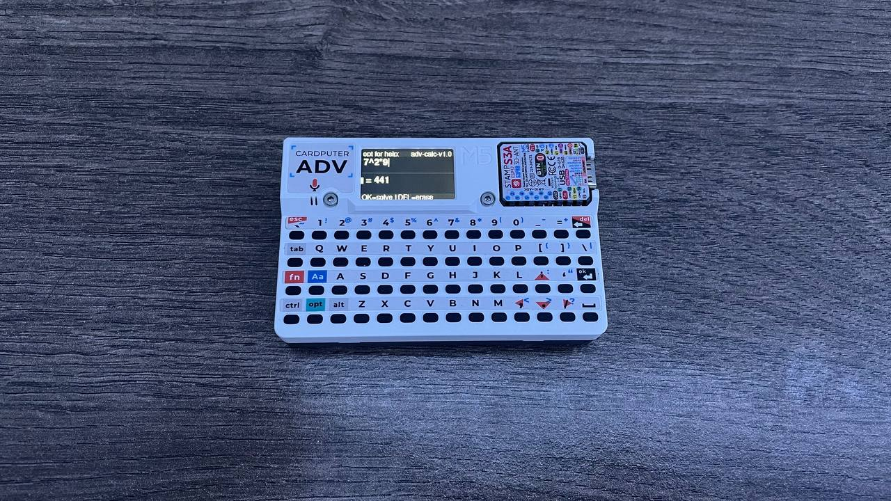
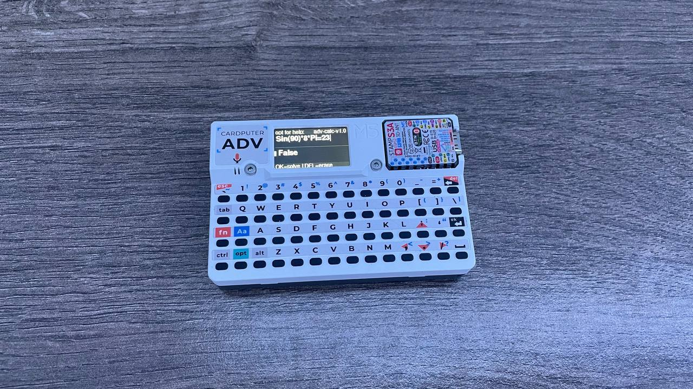
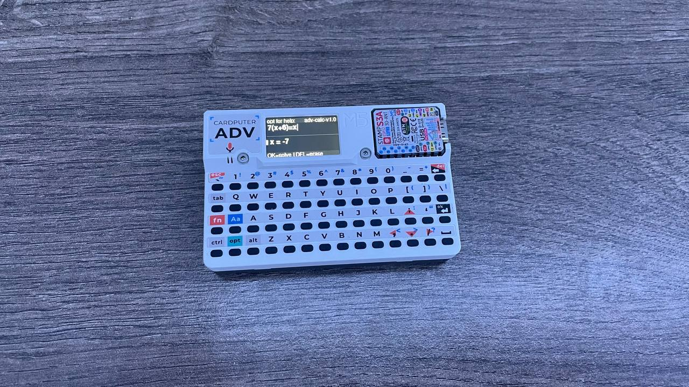

# adv_calc — Advanced Calculator for M5Stack Cardputer ADV

```
             .___                             .__          
 _____     __| _/__  __           ____ _____  |  |   ____  
 \__  \   / __ |\  \/ /  ______ _/ ___\\__  \ |  | _/ ___\ 
  / __ \_/ /_/ | \   /  /_____/ \  \___ / __ \|  |_\  \___ 
 (____  /\____ |  \_/            \___  >____  /____/\___  >
      \/      \/                     \/     \/          \/ 
```

A scientific calculator for the **M5Stack Cardputer ADV**, written in C++ (Arduino IDE).  
Supports arithmetic, equality checks, and linear equation solving — all on a device the size of a credit card.

---

## Features

### Arithmetic
Standard expressions with correct operator precedence, parentheses, and scientific functions.

```
7^2*9         →  = 441
3*Pi          →  =~ 9.42478
Sin(Rad(45))  →  =~ 0.707107
Sqrt(144)     →  = 12
```



### Equality Check
Verify whether an expression is mathematically true or false.

```
Sin(90)*8*Pi = 23  →  False
2^8 = 256          →  True
Sqrt(9) = 3        →  True
```



### Linear Equation Solver
Solve for a single variable. Variable can be on either side of the equation.

```
7(x+6) = x     →  x = -7
2x + 3 = 6     →  x =~ 1.5
2 + 3 = x      →  x = 5
3*Pi = x       →  x =~ 9.4248
```



### Built-in Function Menu
Press **Fn** to open the function picker: `Sin()` `Cos()` `Tan()` `Rad()` `Pi` `E` `Sqrt()`  
Navigate with **↑ ↓**, confirm with **OK**.

---

## Controls

| Key | Action |
|-----|--------|
| `OK` | Solve / evaluate |
| `DEL` | Backspace |
| `,` | Cursor left |
| `/` | Cursor right |
| `Caps` + `→` | Insert `/` (divide) |
| `Caps` + `↓` | Insert `.` (decimal point) |
| `Fn` | Open function menu |
| `Opt` | Toggle help screen |

---

## Installation

Download the latest `adv_calc-v1.0.bin` from [**Releases**](https://github.com/flamyez/adv_calc/releases/latest).

### Option A — SD card via Launcher *(recommended)*
No need to reflash every time — just swap the `.bin` on the SD card when you want to use it.

1. Copy `adv_calc-v1.0.bin` to the root of your SD card
2. Insert SD card into Cardputer ADV
3. Open Launcher → select the `.bin` → install

### Option B — Flash directly
Replaces whatever is currently on the device. Good if you don't use the Launcher.

**Using [web.esphome.io](https://web.esphome.io) (browser, no install needed):**
1. Connect Cardputer ADV via USB
2. Open web.esphome.io → **Install** → pick `adv_calc-v1.0.bin`
3. Done

**Using esptool (command line):**
```bash
esptool.py --chip esp32s3 --port COM3 --baud 1500000 \
  write_flash 0x0 adv_calc-v1.0.bin
```
Replace `COM3` with your actual port (`/dev/ttyUSBx` on Linux/Mac).

---

## Building from source

**Requirements:**
- Arduino IDE 2.x
- Board: `ESP32S3 Dev Module` (via Espressif ESP32 board package v3.x)
- Flash Size: `8MB`
- Partition Scheme: `8M with spiffs`
- Library: [`M5Cardputer`](https://github.com/m5stack/M5Cardputer) ≥ 1.1.1 (includes M5Unified + M5GFX)

**Steps:**
1. Clone this repo
2. Open `adv_calc/adv_calc.ino` in Arduino IDE
3. Select board settings above
4. **Sketch → Export Compiled Binary** to get a `.bin`, or just **Upload** directly

---

## Known Issues

| Issue | Details |
|-------|---------|
| `2Pi^2` gives `~39.48` instead of `~19.74` | Implicit multiplication binds tighter than `^`. Use `2*Pi^2` as a workaround. |
| Quadratic equations not supported | `x^2 = 4` will give a wrong answer. The solver is linear-only. Planned for v1.1. |
| Variable name collision | Don't use `e` as a variable name — it's reserved for Euler's number. Single-letter variables like `x`, `y`, `n` work fine. |

---

## License

MIT — do whatever you want, just don't claim you wrote it from scratch.
